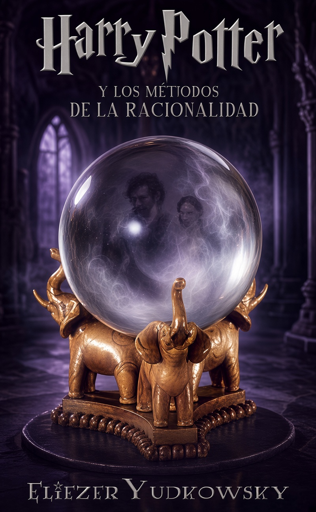

# Harry Potter and the Methods of Rationality (HPMOR): traducción al español y edición bilingüe

[](https://github.com/marcmorente/hpmor-es/releases/latest)
[](LICENSE)

<p align="center">
  <a href="https://github.com/marcmorente/hpmor-es/releases/latest">
    
  </a>
</p>

Traducción al español de *Harry Potter and the Methods of Rationality*, de
Eliezer Yudkowsky, con edición bilingüe incorporada.

## Sobre este proyecto

Este es un proyecto personal. Ofrece dos libros electrónicos gratuitos: la
traducción completa de HPMOR al español y una versión bilingüe
inglés-español. La obra original es una *fanfiction* de Eliezer Yudkowsky.
Lo he realizado por disfrute, sin ningún fin comercial, y lo ofrezco por si
resulta útil a otras personas.

El proyecto contiene dos libros electrónicos:

- **Edición en español** (`hpmor.epub`): la traducción completa de la obra,
  con los 122 capítulos y las notas del autor.
- **Edición bilingüe** (`hpmor-bilingue.epub` y `hpmor-bilingue.html`): el
  texto original en inglés. Cada párrafo lleva una marca `*`; al pulsarla se
  muestra la traducción española de ese párrafo.

La obra original se lee gratis en [hpmor.com](https://www.hpmor.com).

## Descargas

Los tres libros se publican en
[GitHub Releases](https://github.com/marcmorente/hpmor-es/releases/latest).

## Contenido del repositorio

| Fichero o directorio | Descripción |
|---|---|
| `hpmor.html` | La traducción española completa, en un solo fichero HTML. Es el texto fuente de este proyecto. |
| `hpmor-en.html` | El texto original en inglés. Procede de la edición revisada del proyecto [rrthomas/hpmor](https://github.com/rrthomas/hpmor). |
| `hpmor.epub` | Edición española en EPUB. Fichero generado. |
| `hpmor-bilingue.epub` | Edición bilingüe en EPUB. Fichero generado. |
| `hpmor-bilingue.html` | Edición bilingüe en HTML, en un solo fichero. Fichero generado. |
| `bilingue/` | Programa en Rust que genera los tres libros a partir de `hpmor.html` y `hpmor-en.html`. Incluye su propio `README.md`. |
| `hpmor-portada.jpg` | Portada de la edición española. |
| `hpmor-bilingue-cover.jpg` | Portada de la edición bilingüe. |
| `ESTILO.md` | Normas de estilo de la traducción. |
| `GLOSARIO.md` | Glosario de términos y decisiones léxicas. |
| `VOCES.md` | Guía de las voces de los personajes. |
| `PROCESO.md` | Descripción del proceso de traducción y revisión. |
| `PROMPTS.md` | Instrucciones utilizadas en las sesiones de traducción. |
| `encargos/` | Instrucciones de cada rol del proceso: traductor, revisor y corrector. |
| `validar.py` | Script de validación: compara etiquetas y estructura entre el inglés y el español. |
| `.work/` | Ficheros de trabajo interno. No forman parte del proyecto. |

## Cómo regenerar los libros

Necesita [Rust](https://www.rust-lang.org). Ejecute:

```sh
cargo build --release
./bilingue/target/release/bilingue
```

El programa genera los tres libros en la raíz del repositorio. Antes de
generar nada, comprueba que el inglés y el español tienen la misma estructura
de párrafos. Si la comprobación falla, el programa se detiene y no genera un
libro desalineado.

## Cómo se ha hecho este proyecto

La traducción está realizada íntegramente con inteligencia artificial, bajo
mi dirección. El proceso usa tres roles automatizados, con instrucciones
públicas en este repositorio:

1. **Traductor**: traduce cada capítulo siguiendo `ESTILO.md`.
2. **Revisor bilingüe**: coteja el español contra el inglés, párrafo a
   párrafo.
3. **Corrector de estilo**: revisa que el español suene natural.

`GLOSARIO.md` y `VOCES.md` fijan la terminología y la voz de cada personaje.
`validar.py` y las comprobaciones del generador verifican la integridad del
texto en cada paso.

## Créditos y atribución

- *Harry Potter and the Methods of Rationality* es obra de
  **Eliezer Yudkowsky**. La web oficial es
  [hpmor.com](https://www.hpmor.com); allí puede leer la obra original,
  las notas del autor y el listado oficial de
  [traducciones](https://www.hpmor.com/info/).
- El texto inglés de este repositorio procede de la edición revisada del
  proyecto [rrthomas/hpmor](https://github.com/rrthomas/hpmor).
- *Harry Potter* y todos los personajes y escenarios relacionados son
  propiedad de **J. K. Rowling**. Este proyecto es una obra de fans sin
  ánimo de lucro y no pretende infringir ningún derecho de autor.

## Licencias

- El **código** de este repositorio (`bilingue/` y `validar.py`) se publica
  bajo la [licencia MIT](LICENSE).
- La **traducción**, las portadas y los libros generados se publican bajo la
  licencia [CC BY-NC-SA 4.0](LICENSE-CONTENT): puede compartirlos y
  adaptarlos con atribución, sin fines comerciales y con la misma licencia.
- La obra original y sus personajes mantienen los derechos de sus autores.
  Vea `LICENSE-CONTENT` para los detalles.
